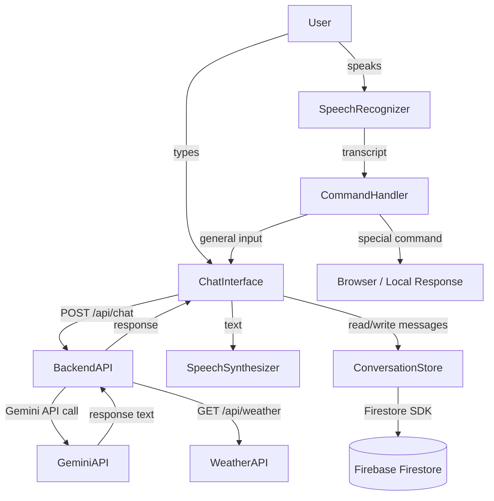

# Design Document: AI Voice Assistant

## Overview

The AI Voice Assistant is a full-stack web application composed of a React frontend and a Node.js/Express backend. Users speak into their browser microphone; the Web Speech API transcribes the audio to text. Special commands are handled locally; all other input is forwarded to the backend, which proxies the request to the Gemini AI API. The response is displayed in a ChatGPT-style chat interface and read aloud via the browser Speech Synthesis API. All messages are persisted to Firebase Firestore for session-based history.

---

## Architecture



**Data flow summary:**
1. SpeechRecognizer captures audio → produces transcript
2. CommandHandler checks for special commands; if matched, handles locally
3. Otherwise, frontend sends `POST /api/chat` to Express backend
4. Backend calls Gemini API, returns response text
5. Frontend displays response in ChatInterface and plays it via SpeechSynthesizer
6. ConversationStore writes each message to Firestore

---

## Components and Interfaces

### Frontend Components (React)

#### `App`
Root component. Manages global state: session ID, message list, loading/listening/speaking flags.

#### `ChatInterface`
Renders the scrollable message list, the text input bar, and the microphone button. Receives message list and state flags as props.

#### `MessageBubble`
Renders a single message with role-based styling (user = right-aligned, assistant = left-aligned), content, and timestamp.

#### `MicButton`
Toggles the SpeechRecognizer on/off. Shows animated pulse when listening.

#### `StatusBar`
Displays current state: idle / listening / thinking / speaking.

### Frontend Services

#### `speechRecognizer.ts`
Wraps `window.SpeechRecognition`. Exposes `start()`, `stop()`, and an `onResult(transcript)` callback.

#### `speechSynthesizer.ts`
Wraps `window.speechSynthesis`. Exposes `speak(text, onEnd)`.

#### `commandHandler.ts`
Checks a transcript against known command patterns. Returns a `CommandResult`:
```ts
type CommandResult =
  | { type: 'open_url'; url: string; message: string }
  | { type: 'search'; query: string; message: string }
  | { type: 'time'; message: string }
  | { type: 'date'; message: string }
  | { type: 'weather'; city: string }
  | { type: 'none' }
```

#### `apiClient.ts`
Axios-based HTTP client. Exposes:
```ts
sendMessage(message: string, history: Message[]): Promise<string>
getWeather(city: string): Promise<string>
```

#### `conversationStore.ts`
Firebase Firestore integration. Exposes:
```ts
initSession(): string                          // returns sessionId
saveMessage(sessionId: string, msg: Message): Promise<void>
loadHistory(sessionId: string): Promise<Message[]>
```

### Backend (Express)

#### `POST /api/chat`
Request body: `{ message: string, history: Message[] }`
Response: `{ response: string }`

#### `GET /api/weather`
Query: `?city={city}`
Response: `{ weather: string }` — a human-readable weather summary string

#### `geminiService.ts`
Calls the Gemini API using `@google/generative-ai`. Formats history into Gemini's `Content[]` format and returns the response text.

#### `weatherService.ts`
Calls OpenWeatherMap API (free tier). Returns a formatted string like:
`"Weather in London: 12°C, partly cloudy, humidity 78%"`

---

## Data Models

### `Message`
```ts
interface Message {
  id: string;          // UUID
  role: 'user' | 'assistant';
  content: string;
  timestamp: number;   // Unix ms
}
```

### `Session`
Stored in `localStorage` as `{ sessionId: string }`.
Firestore path: `sessions/{sessionId}/messages/{messageId}`

### Firestore Document Schema
```json
{
  "id": "uuid-v4",
  "role": "user" | "assistant",
  "content": "string",
  "timestamp": 1710000000000
}
```

### Backend Request/Response

`POST /api/chat` request:
```json
{ "message": "What is the capital of France?", "history": [] }
```

`POST /api/chat` response:
```json
{ "response": "The capital of France is Paris." }
```

`GET /api/weather?city=London` response:
```json
{ "weather": "Weather in London: 12°C, partly cloudy, humidity 78%" }
```

Error response (all endpoints):
```json
{ "error": "Descriptive error message" }
```

---

## Correctness Properties

*A property is a characteristic or behavior that should hold true across all valid executions of a system — essentially, a formal statement about what the system should do. Properties serve as the bridge between human-readable specifications and machine-verifiable correctness guarantees.*


### Property 1: Microphone toggle is a round-trip

*For any* SpeechRecognizer instance, calling `start()` followed by `stop()` should return the recognizer to idle state (not listening).

**Validates: Requirements 1.1, 1.3**

---

### Property 2: Listening state drives visual indicator

*For any* ChatInterface rendered with `isListening = true`, the listening indicator element should be present in the DOM.

**Validates: Requirements 1.6**

---

### Property 3: Chat API payload always includes history (capped at 10)

*For any* conversation history of length N and any new message, the payload sent to `POST /api/chat` should contain the message and `min(N, 10)` history entries.

**Validates: Requirements 2.1, 2.5**

---

### Property 4: API client round-trip

*For any* valid message and history, `apiClient.sendMessage()` should return the response string produced by the mocked backend without modification.

**Validates: Requirements 2.2**

---

### Property 5: Speaking state drives visual indicator

*For any* ChatInterface rendered with `isSpeaking = true`, the speaking indicator element should be present in the DOM.

**Validates: Requirements 3.2**

---

### Property 6: Speech synthesis completes to idle

*For any* response text passed to `SpeechSynthesizer.speak()`, invoking the `onEnd` callback should transition the application state to idle (not speaking).

**Validates: Requirements 3.3**

---

### Property 7: URL command detection

*For any* transcript string containing "open youtube" or "open google" (case-insensitive), `CommandHandler.handle()` should return a result of type `open_url` with the correct URL.

**Validates: Requirements 4.1, 4.2**

---

### Property 8: Search command extraction

*For any* transcript string matching "search [query]" (case-insensitive), `CommandHandler.handle()` should return a result of type `search` with the query correctly extracted.

**Validates: Requirements 4.3**

---

### Property 9: Time and date commands produce formatted responses

*For any* transcript matching a time or date phrase, `CommandHandler.handle()` should return a result whose `message` field matches the expected format (HH:MM AM/PM for time, human-readable date for date).

**Validates: Requirements 4.4, 4.5**

---

### Property 10: Weather command extracts city

*For any* transcript matching "weather in [city]" or "weather of [city]", `CommandHandler.handle()` should return a result of type `weather` with the city name correctly extracted.

**Validates: Requirements 4.6**

---

### Property 11: All command results carry a non-empty message

*For any* transcript that matches a special command pattern, the `CommandResult` returned by `CommandHandler.handle()` should have a non-empty `message` string.

**Validates: Requirements 4.8, 4.9**

---

### Property 12: Messages rendered in chronological order

*For any* list of messages with distinct timestamps, the ChatInterface should render them in ascending timestamp order.

**Validates: Requirements 5.1**

---

### Property 13: Message bubble contains role styling and timestamp

*For any* Message object, the rendered `MessageBubble` should contain a role-specific CSS class and a non-empty timestamp string.

**Validates: Requirements 5.3, 5.4**

---

### Property 14: Loading indicator visible during processing

*For any* ChatInterface rendered with `isLoading = true`, the loading indicator element should be present in the DOM.

**Validates: Requirements 5.5**

---

### Property 15: Session ID uniqueness

*For any* two separate calls to `ConversationStore.initSession()` on a fresh store (no existing localStorage), the returned session IDs should be different strings.

**Validates: Requirements 6.1**

---

### Property 16: Message persistence round-trip

*For any* Message object saved via `ConversationStore.saveMessage()`, a subsequent call to `ConversationStore.loadHistory()` for the same session should return a list containing that message.

**Validates: Requirements 6.2, 6.3**

---

### Property 17: Firestore path correctness

*For any* session ID and message, `ConversationStore.saveMessage()` should write to the Firestore path `sessions/{sessionId}/messages/{messageId}`.

**Validates: Requirements 6.4**

---

### Property 18: Empty transcript is ignored

*For any* string composed entirely of whitespace or the empty string, calling the transcript handler should not trigger any call to `apiClient.sendMessage()` or `CommandHandler.handle()`.

**Validates: Requirements 8.3**

---

## Error Handling

- **SpeechRecognizer errors**: `onerror` event sets state to idle and surfaces a user-readable message in the chat. Specific error codes (`not-allowed`, `no-speech`, `network`) map to distinct messages.
- **API errors**: `apiClient` catches Axios errors. Network errors show "Service unavailable, please try again." Non-2xx responses show the server's `error` field.
- **Firestore errors**: `conversationStore` wraps all Firestore calls in try/catch. Write failures are logged to console; read failures return an empty array so the UI still loads.
- **Speech Synthesis errors**: Wrapped in a try/catch; if `speechSynthesis` is undefined, the function is a no-op and the response is shown as text only.
- **Backend validation**: Express middleware validates required fields and returns 400 with `{ error: "..." }` for missing inputs.
- **Environment variables**: Backend logs a `console.warn` for each missing required env var at startup; the server still starts but affected endpoints return 500 with a clear message.

---

## Testing Strategy

### Dual Testing Approach

Both unit tests and property-based tests are required and complementary:
- Unit tests cover specific examples, integration points, and edge cases.
- Property-based tests verify universal correctness across randomized inputs.

### Property-Based Testing

Library: **fast-check** (TypeScript/JavaScript) for both frontend and backend.

Each property test must run a minimum of 100 iterations. Each test must be tagged with a comment referencing the design property:

```
// Feature: ai-voice-assistant, Property N: <property text>
```

Each correctness property (1–18) must be implemented as a single property-based test using `fc.assert(fc.property(...))`.

### Unit Testing

Library: **Vitest** (frontend) and **Jest** (backend).

Unit tests focus on:
- Specific command strings (e.g., exact "open youtube" match)
- Edge cases: empty transcript, missing env vars, Firestore failure, API timeout
- Integration: `App` component wiring (SpeechRecognizer → CommandHandler → apiClient → ChatInterface)
- Backend endpoint contracts: correct status codes, response shapes

### Test File Structure

```
frontend/src/
  __tests__/
    commandHandler.test.ts       # unit + property tests
    conversationStore.test.ts    # unit + property tests
    apiClient.test.ts            # unit + property tests
    ChatInterface.test.tsx       # unit + property tests
    speechSynthesizer.test.ts    # unit tests

backend/src/
  __tests__/
    geminiService.test.ts        # unit tests
    weatherService.test.ts       # unit tests
    routes.test.ts               # unit tests (supertest)
```
